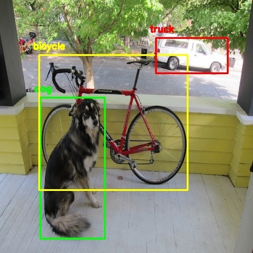

# Object-Detection-and-Segmentation-using-YOLO-lib
This project uses YOLO lib to detect up to 80 objects (Videos and Images as inputs). 

# Object detection using deep learning with OpenCV and Python 

OpenCV `dnn` module supports running inference on pre-trained deep learning models from popular frameworks like Caffe, Torch and TensorFlow. 

When it comes to object detection, popular detection frameworks are
 * YOLO
 * SSD
 * Faster R-CNN
 
 Support for running YOLO/DarkNet has been added to OpenCV dnn module recently. 
 
 ## Dependencies
  * opencv
  * numpy
  
`pip install numpy opencv-python`

**Note: Compatability with Python 2.x is not officially tested.**

 ## YOLO (You Only Look Once)
 
 Download the pre-trained YOLO v3 weights file from this [link](https://pjreddie.com/media/files/yolov3.weights) and place it in the current directory or you can directly download to the current directory in terminal using
 
 `$ wget https://pjreddie.com/media/files/yolov3.weights`
 
 Provided all the files are in the current directory, below command will apply object detection on the input image `dog.jpg`.
 
 `$ python yolo_opencv.py --image dog.jpg --config yolov3.cfg --weights yolov3.weights --classes yolov3.txt`
 
 
 **Command format** 
 
 _$ python yolo_opencv.py --image /path/to/input/image --config /path/to/config/file --weights /path/to/weights/file --classes /path/to/classes/file_
 
 Checkout the [blog post](http://www.arunponnusamy.com/yolo-object-detection-opencv-python.html) to learn more.
 
 ### sample output :
 
 
 # cv-tricks.com: Learn computer vision and artificial intelligence
Repository for all the tutorials and codes shared at cv-tricks.com

# Tensorflow tutorials: 

#1 10 minutes Practical TensorFlow lesson for quick learners: If you have just heard about Tensorflow and are looking to get started, then go to this blog post http://cv-tricks.com/artificial-intelligence/deep-learning/deep-learning-frameworks/tensorflow-tutorial/ and in the end we train a simple linear classifier to absorb what we have studied. Code is here https://github.com/sankit1/cv-tricks.com/tree/master/Tensorflow-tutorials/first_tutorial

#2 Build image classifier using Tensorflow: In this blogpost http://cv-tricks.com/tensorflow-tutorial/training-convolutional-neural-network-for-image-classification/ , We build a simple convolutional neural network using Tensorflow. Code is here: https://github.com/sankit1/cv-tricks.com/tree/master/Tensorflow-tutorials/tutorial-2-image-classifier. 

#3 Learn to save and restore Tensorflow Models: BlogPost here: http://cv-tricks.com/tensorflow-tutorial/save-restore-tensorflow-models-quick-complete-tutorial/

#4 Tutorial to Learn TF-slim and run VGG, Inception and other popular networks. Code here: https://github.com/sankit1/cv-tricks.com/tree/master/Tensorflow-tutorials/Tensorflow-slim-run-prediction 

#5. Installing and getting started with Keras. Code here:  https://github.com/sankit1/cv-tricks.com/tree/master/Tensorflow-tutorials/Keras-Tensorflow-tutorial

# Advanced Topics(Blogs): 

1. Object Detection algorithms. http://cv-tricks.com/artificial-intelligence/object-detection-using-deep-learning-for-advanced-users-part-1/
2. Image Segmentation using Tensorflow . http://cv-tricks.com/image-segmentation/transpose-convolution-in-tensorflow/
3. Show-Attend-and-Tell: Finer details of Image Captioning. http://cv-tricks.com/image-segmentation/transpose-convolution-in-tensorflow/
4. Accelerating CNNs on Raspberry Pi: http://cv-tricks.com/artificial-intelligence/deep-learning/accelerating-convolutional-neural-networks-on-raspberry-pi/
